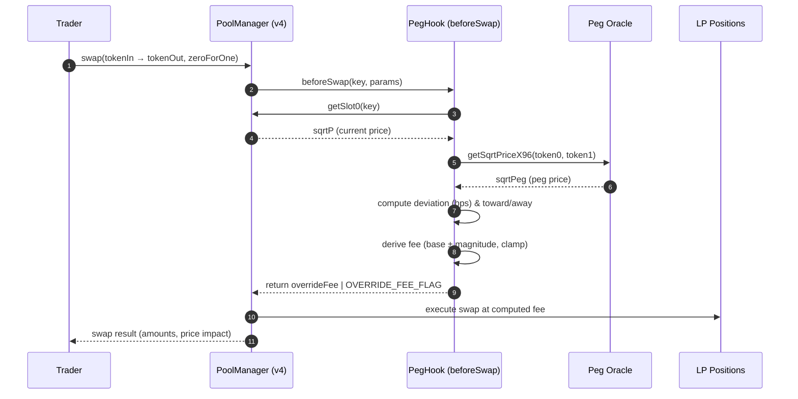
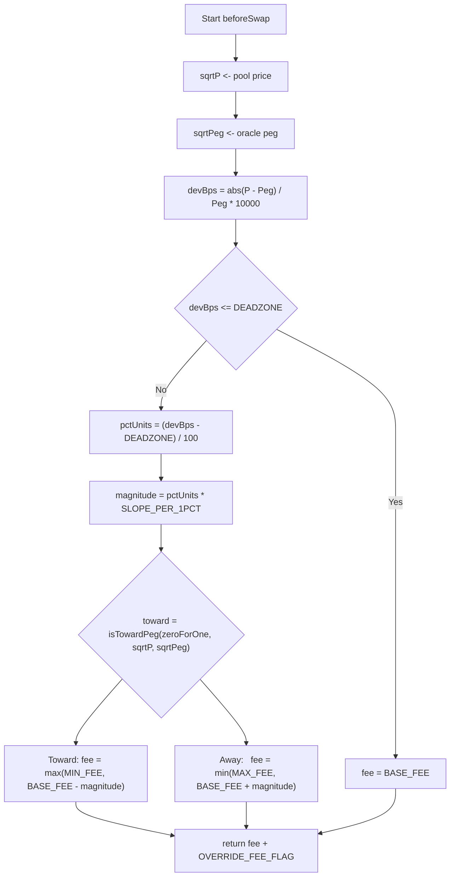

# 🪙 PegHook — Dynamic Asymmetric Fee Hook for Uniswap V4

### Overview

**PegHook** is a Uniswap v4 **dynamic fee hook** that stabilizes the price of a pegged asset (e.g., `yBTC`) around its target oracle price by adjusting swap fees **asymmetrically** based on deviation from the peg.

- When the pool price **deviates above** the peg (asset overpriced), fees **increase** for swaps that push price **further away** and **decrease** for swaps that bring it **back toward** the peg.
- When the pool price **deviates below** the peg (asset underpriced), the logic flips symmetrically.

This mechanism discourages trades that destabilize the peg and rewards trades that restore equilibrium — creating a **soft-peg stabilizer** driven purely by on-chain incentives.

---

### 🔧 Core Idea

| Situation      | Desired trader behavior    | Fee adjustment                                                                              |
| -------------- | -------------------------- | ------------------------------------------------------------------------------------------- |
| **yBTC > peg** | Encourage **selling yBTC** | Lower fees for `yBTC → USDC` swaps (toward peg), higher fees for `USDC → yBTC` swaps (away) |
| **yBTC < peg** | Encourage **buying yBTC**  | Lower fees for `USDC → yBTC` swaps (toward peg), higher fees for `yBTC → USDC` swaps (away) |

Fees are recomputed dynamically in every `beforeSwap` call.

---

### 🔁 How It Works

1. **Pool Price** — Read from `StateLibrary.getSlot0()`
2. **Peg Price** — From on-chain oracle (e.g., Chainlink or vault oracle)
3. **Deviation** — Calculated as  
   \[
   \text{devBps} = \frac{|p*{pool} - p*{peg}|}{p\_{peg}} \times 10{,}000
   \]
4. **Direction Detection** — Determine whether the swap moves price _toward_ or _away_ from the peg:
   ```solidity
   bool toward = _isTowardPeg(zeroForOne, sqrtP, sqrtPeg);
   ```
   - `zeroForOne` → swap lowers price
   - `!zeroForOne` → swap raises price
5. **Fee Adjustment**
   ```solidity
   if (toward) fee = base - magnitude; // cheaper toward peg
   else fee = base + magnitude;        // costlier away from peg
   ```
   Clamped between `MIN_FEE` and `MAX_FEE`.

---


### 🧠 Behavior Summary

| Condition        | zeroForOne        | Action                  | Fee impact    |
| ---------------- | ----------------- | ----------------------- | ------------- |
| yBTC overpriced  | true (yBTC→USDC)  | move down toward peg    | lower fee ✅  |
| yBTC overpriced  | false (USDC→yBTC) | move up away from peg   | higher fee ❌ |
| yBTC underpriced | true (yBTC→USDC)  | move down away from peg | higher fee ❌ |
| yBTC underpriced | false (USDC→yBTC) | move up toward peg      | lower fee ✅  |

---


### 📊 Diagrams

#### 1. Sequence: swap → hook → fee decision → pool



#### 2. Flow: asymmetric fee logic



---

### 🧭 Future Extensions

- Integrate Chainlink or Uniswap v3 TWAP oracle feed.
- Add configurable slope and deadzone via governance.
- Replace linear fee slope with a **sigmoid** or **logarithmic** curve for smoother response.
- Optionally route part of excess fees to a **treasury** or **rebate pool** for LPs.

---


## ✨ What’s inside

Scripts (all paths relative to repo root):

- `script/00_DeployHook.s.sol` – Mines flags & deploys `PegHook` with `CREATE2`
- `script/01_CreatePoolAndAddLiquidityPegHook.s.sol` – Initializes pool **with the hook** and mints initial liquidity (1 tx flow via PositionManager)
- `script/02_AddLiquidity.s.sol` – Adds more liquidity to an existing pool/position
- `script/03_Swap.s.sol` – Executes a swap through the pool (dynamic fee applied by hook)

Hook requires **dynamic fees**; your pool’s `PoolKey.fee` must be **0x800000** (the `DYNAMIC_FEE_FLAG`) — not `flag | base`.

---

## 🔧 Prerequisites

- **Foundry** (forge/cast): <https://book.getfoundry.sh/>
- Node (optional, for any TS/viem tooling you use)
- RPC for **Arbitrum Sepolia**

---

## 🔑 Environment

Create a `.env` in the repo root:

```bash
# Network
ARBITRUM_SEPOLIA_RPC=https://sepolia-rollup.arbitrum.io/rpc

# Deployer key (choose one style)
# 1) Use CLI flag --private-key (recommended), or
# 2) Make available to scripts:
WALLET_SECRET=0xYOUR_PRIVATE_KEY

# Uniswap v4 addresses (Arbitrum Sepolia)
POOL_MANAGER=0xFB3e0C6F74eB1a21CC1Da29aeC80D2Dfe6C9a317
POSITION_MANAGER=0xAc631556d3d4019C95769033B5E719dD77124BAc
PERMIT2=0x000000000022D473030F116dDEE9F6B43aC78BA3
STATE_VIEW=0x9D467FA9062b6e9B1a46E26007aD82db116c67cB

# Tokens (example)
USDC=0x5eff990c0A24A5F384119808398d1A64cE4BC537   # 6 decimals
yBTC=0x65eDC65510AE691bb4F2BeD5283A004e4ebD8Ee3   # 18 decimals

# (Filled after deploy)
HOOK_ADDR=0x... # set by 00_DeployHook.s.sol output

# Optional: position introspection
TICK_LOWER=-887280
TICK_UPPER=887280
```

> If you don’t want the script to read `WALLET_SECRET`, pass `--private-key 0x...` on the CLI instead.

---

## ⚙️ Install & Build

```bash
forge install
forge build
```

---

## 1) 🚀 Deploy the PegHook

The hook address must encode specific **permission flags** in its `CREATE2` address. The script mines a salt and deploys.

```bash
forge script script/00_DeployHook.s.sol   --rpc-url $ARBITRUM_SEPOLIA_RPC   --broadcast   --private-key 0xYOUR_PRIVATE_KEY
```

Output will include the **hook address**. Put it into `.env` as `HOOK_ADDR`.

**Expected permissions** (example): `beforeInitialize=true`, `beforeSwap=true`, others false — matching your hook’s `getHookPermissions()`.

---

## 2) 🫧 Create Pool & Add Initial Liquidity (with PegHook)

This initializes the pool with `PoolKey` that includes your `HOOK_ADDR` and the **dynamic fee flag**:

> **Important:** `fee = 0x800000` (only the flag), not `0x800000 | 3000`.

```bash
forge script script/01_CreatePoolAndAddLiquidityPegHook.s.sol   --rpc-url $ARBITRUM_SEPOLIA_RPC   --broadcast   --private-key 0xYOUR_PRIVATE_KEY
```

This script:

- Sorts tokens into `currency0/currency1`
- Computes `sqrtPriceX96` for your desired start price
- Calls `PositionManager.initializePool` and `modifyLiquidities` to mint your first position

---

## 3) ➕ Add More Liquidity

```bash
forge script script/02_AddLiquidity.s.sol   --rpc-url $ARBITRUM_SEPOLIA_RPC   --broadcast   --private-key 0xYOUR_PRIVATE_KEY
```

Configure the desired range / amounts inside the script (or via env), then mint more liquidity to the same pool.

---

## 4) 🔁 Swap

```bash
forge script script/03_Swap.s.sol   --rpc-url $ARBITRUM_SEPOLIA_RPC   --broadcast   --private-key 0xYOUR_PRIVATE_KEY
```

Your hook will set the **dynamic LP fee** in `beforeSwap` (it must return `fee | OVERRIDE_FEE_FLAG`).

---


## 🧪 Common gotchas & fixes

- **`MustUseDynamicFee()` on initialize** – you used `fee=3000`. Set `fee=0x800000`.
- **`LPFeeTooLarge`** – you used `0x800000 | 3000`. Use **only** `0x800000`.
- **“No wallets found” (Foundry)** – pass `--private-key 0x...`, or ensure the script loads your key correctly.
- **`execution reverted` on `modifyLiquidities`** – check approvals, `amountMax`, tick bounds snapped to `tickSpacing`, and that the **PoolKey** (fee/spacing/hooks/token order) matches the initialized pool.
- **Address checksum errors (viem)** – normalize with `getAddress()` and ensure no hidden characters.

---

## 🗺️ Addresses (Arbitrum Sepolia)

- **PoolManager**: `0xFB3e0C6F74eB1a21CC1Da29aeC80D2Dfe6C9a317`
- **PositionManager**: `0xAc631556d3d4019C95769033B5E719dD77124BAc`
- **StateView**: `0x9D467FA9062b6e9B1a46E26007aD82db116c67cB`
- **Permit2**: `0x000000000022D473030F116dDEE9F6B43aC78BA3`

(If these change, update your `.env`.)

---

## 📂 Project layout

```
src/
  PegHook.sol           # your dynamic-fee hook
  ...
script/
  00_DeployHook.s.sol
  01_CreatePoolAndAddLiquidityPegHook.s.sol
  02_AddLiquidity.s.sol
  03_Swap.s.sol
```

---

### 📜 License

MIT License © 2025  
Developed for research and experimentation on Uniswap v4 Hooks.

---

## 📈 Appendix — Soft‑Peg Scenarios

Below are concrete examples showing how asymmetric dynamic fees behave with your chosen parameters:

| Parameter           | Value                              |
| ------------------- | ---------------------------------- |
| **MIN_FEE**         | 0.05 % (500 pips)                  |
| **BASE_FEE**        | 0.30 % (3000 pips)                 |
| **MAX_FEE**         | 10 % (100 000 pips)                |
| **DEADZONE_BPS**    | 25 bps (0.25 %)                    |
| **SLOPE_TOWARD**    | 150  (–0.015 % per +1 % deviation) |
| **SLOPE_AWAY**      | 1200  (+0.12 % per +1 % deviation) |
| **ARB_TRIGGER_BPS** | 5 000 bps (50 %)                   |

### LP price below vault (yBTC undervalued)

| Deviation | Toward (buy yBTC, USDC→yBTC) |     Fee | Away (sell yBTC, yBTC→USDC) |    Fee |
| --------- | ---------------------------- | ------: | --------------------------- | -----: |
| 0.1 %     | Dead‑zone                    |  0.30 % | Dead‑zone                   | 0.30 % |
| 1 %       | Dead‑zone                    |  0.30 % | Dead‑zone                   | 0.30 % |
| 5 %       | Cheaper                      |  0.24 % | Costlier                    | 0.78 % |
| 10 %      | Cheaper                      | 0.165 % | Costlier                    | 1.38 % |
| 25 %      | Hits MIN                     |  0.05 % | Higher                      | 3.18 % |
| 50 %+     | Arb zone → MIN               |  0.05 % | Arb zone → MAX              |   10 % |

### LP price above vault (yBTC overvalued)

| Deviation | Toward (sell yBTC, yBTC→USDC) |     Fee | Away (buy yBTC, USDC→yBTC) |    Fee |
| --------- | ----------------------------- | ------: | -------------------------- | -----: |
| 0.1 %     | Dead‑zone                     |  0.30 % | Dead‑zone                  | 0.30 % |
| 1 %       | Dead‑zone                     |  0.30 % | Dead‑zone                  | 0.30 % |
| 5 %       | Cheaper                       |  0.24 % | Costlier                   | 0.78 % |
| 10 %      | Cheaper                       | 0.165 % | Costlier                   | 1.38 % |
| 25 %      | Hits MIN                      |  0.05 % | Higher                     | 3.18 % |
| 50 %+     | Arb zone → MIN                |  0.05 % | Arb zone → MAX             |   10 % |

### Interpretation

- Trades that **move toward the peg** are _rewarded_ with cheaper fees.
- Trades that **move away** from the peg are _penalized_ with steeper fees.
- The **soft‑peg** handles small to medium deviations continuously, while **arbitrage** enforces the hard peg at large deviations.

---
